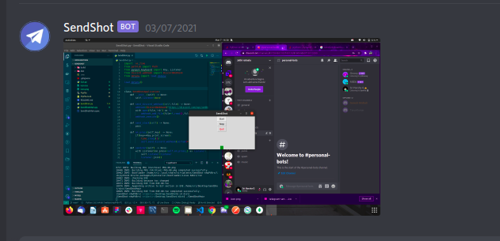

# SendShot

Ever got into a situation where you couldn't take a picture of your laptop screen using your mobile?

This might help you!

- Take a screenshot
- Thats it!
- It will automatically message you that screenshot (Currently this uses discord webhook but can be extended to slack etc)
- Now you can access it from any device!

As simple as that!

## How to use it?

- Install all the requirements
- Create a discord webhook and take down the Webhook URL.
- Create a .env containing WEBHOOK_URL="your-webhook-url"
- python3 SendShotMain.py

## Example

"FOR EDUCATIONAL PURPOSES ONLY"